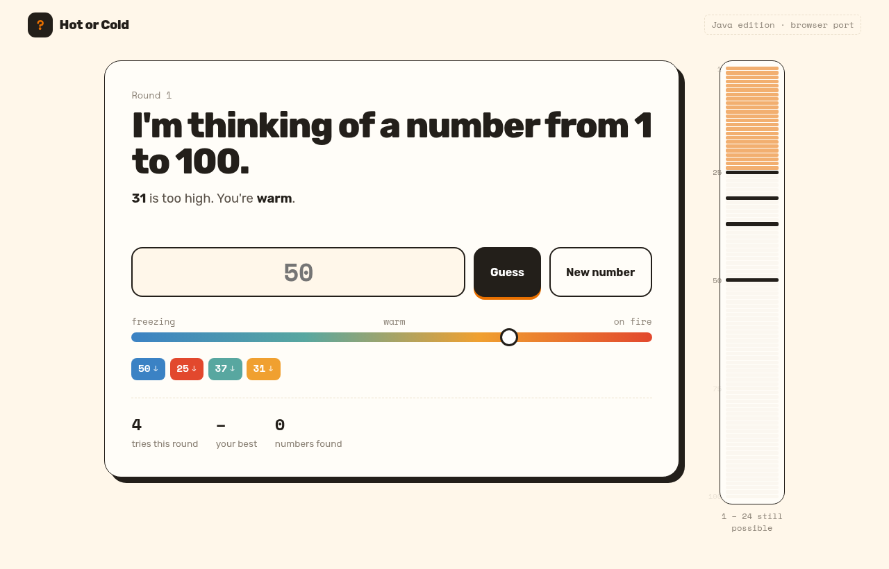

# Number Guessing (Java)

This is the same game as my Python version, written in Java: the computer picks a number from 1 to 100 and you guess until you find it. I wrote it to get comfortable with `Scanner`, `Random`, and parsing input safely in Java, and later split the logic out so it could be tested without a framework.

There's also a **browser version** called *Hot or Cold*, so anyone can play without a JDK.

**Play in your browser:** https://dave-4u.github.io/java-number-guessing/



## Quickstart

Needs JDK 11 or newer.

```bash
./run.sh          # compile + play
./run.sh test     # compile + run the tests
```

Without the script:

```bash
javac -d out src/NumberGuessing.java test/NumberGuessingTest.java
java -cp out NumberGuessing
```

## Features

- Input validation (numbers 1–100 only), `q` to quit, play again, and best score for the session
- `check()` and `parse()` are pure static methods, covered by a dependency-free test class
- Browser port with a heat meter, a shrinking number line, guess history, and confetti

## Tech stack

Java 11+ standard library. The web version is a single HTML file with vanilla JS.

## Roadmap

- Gradle build with JUnit 5
- Difficulty levels and a leaderboard file

## License

MIT © Adegboro David Oluwadamilare
